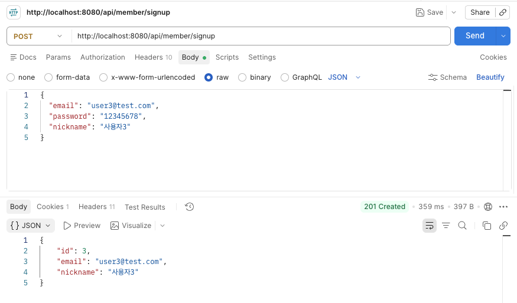
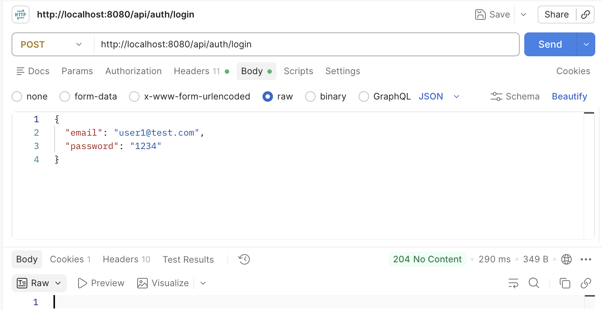
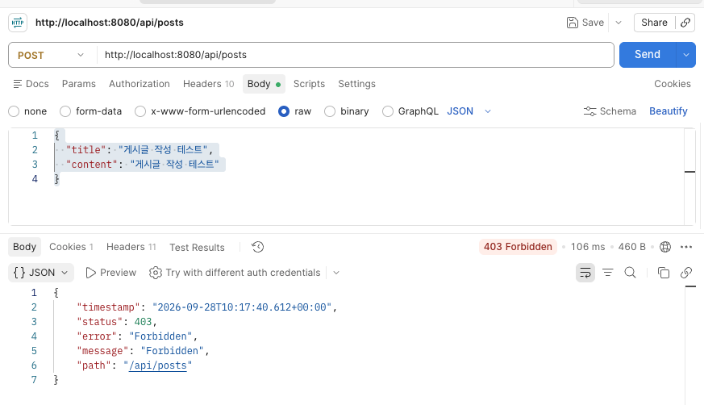
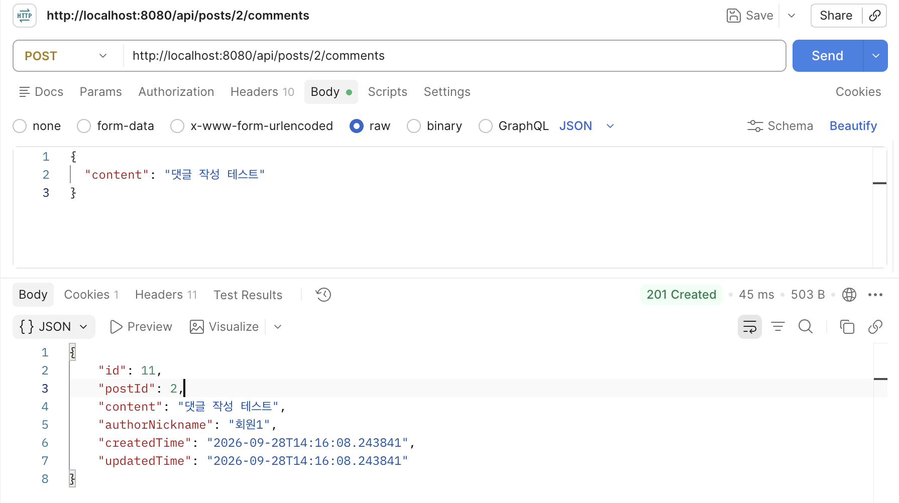
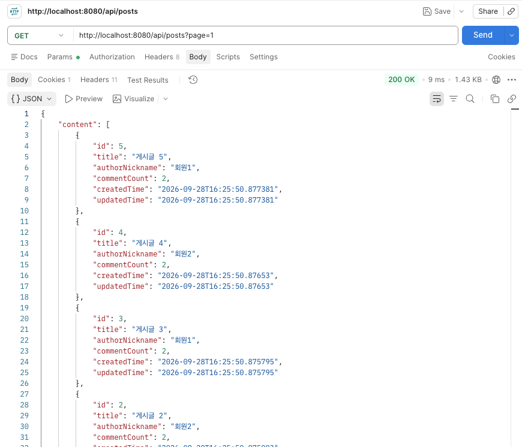
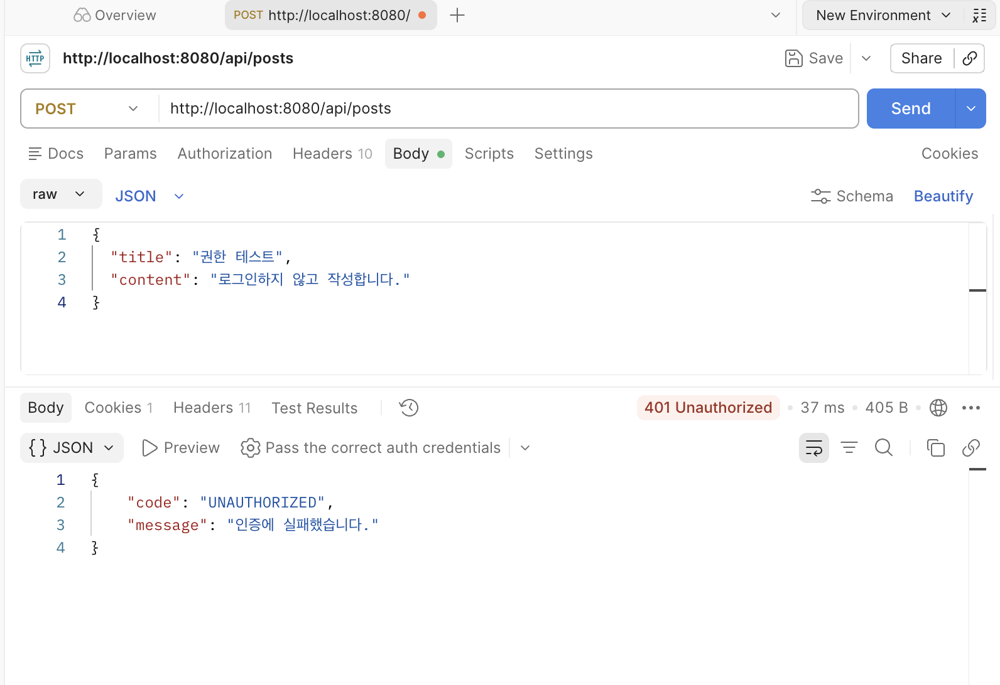
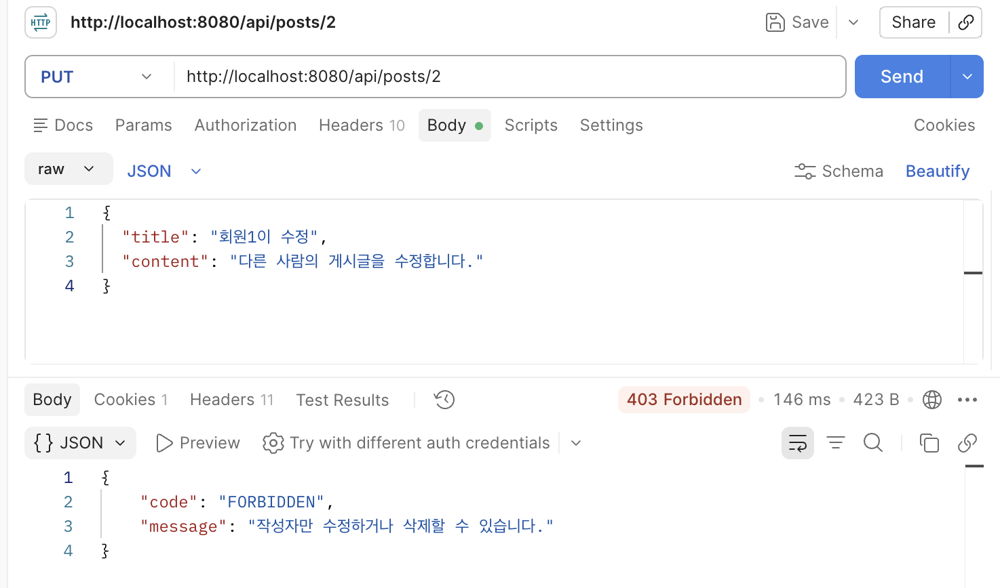

## 1.실행 방법
개발 환경

Java: JDK 21 Framework: Spring Boot 3.5.7 Database: H2 Build Tool: Gradle

DB : H2 데이터베이스

서버 실행 프로젝트 루트 디렉터리에서 다음 명령어를 실행한다.  ./gradlew bootRun 


## 2.API 명세
## API 목록

| 기능 | Method | URL | 인증 필요 | 성공 상태 코드 |
|------|--------|-----|-----------|----------------|
| 회원가입 | POST | `/api/member/signup` | X | 201 |
| 로그인 | POST | `/api/auth/login` | X | 204 |
| 로그인 회원 조회 | GET | `/api/auth/me` | O | 200 |
| CSRF 토큰 발급 | GET | `/api/csrf` | X | 200 |
| 게시글 작성 | POST | `/api/posts` | O | 201 |
| 게시글 목록 조회 | GET | `/api/posts` | X | 200 |
| 게시글 상세 조회 | GET | `/api/posts/{postId}` | X | 200 |
| 게시글 수정 | PUT | `/api/posts/{postId}` | O | 200 |
| 게시글 삭제 | DELETE | `/api/posts/{postId}` | O | 204 |
| 댓글 작성 | POST | `/api/posts/{postId}/comments` | O | 201 |
| 댓글 목록 조회 | GET | `/api/posts/{postId}/comments` | X | 200 |
| 댓글 수정 | PATCH | `/api/comments/{commentId}` | O | 200 |
| 댓글 삭제 | DELETE | `/api/comments/{commentId}` | O | 204 |


**요청 및 응답**

1. 회원가입 (POST)
요청: POST /api/member/signup
요청 Body:
```
{
  "email": "user1@test.com",
  "password": "12345678",
  "nickname": "회원1"
}
```

응답 Body:
```
{
  "id": 1,
  "email": "user1@test.com",
  "nickname": "회원1"
}
```

상태 코드: 201 Created
이메일은 올바른 형식이어야 하며 중복 가입을 허용하지 않는다. 비밀번호는 최소 8자 이상이어야 한다.
비밀번호는 BCrypt로 암호화하여 저장하고, 응답에는 포함하지 않는다.


2. 로그인 (POST)
요청: POST /api/auth/login
요청 Body:
```
{
  "email": "user1@test.com",
  "password": "12345678"
}
```

응답 Body: 없음

상태 코드: 204 No Content
로그인이 성공하면 서버에 인증 정보가 저장된 세션이 생성된다.
클라이언트는 JSESSIONID 쿠키를 통해 이후 요청에서 로그인 상태를 유지한다.


3. 로그인 회원 조회 (GET)
요청: GET /api/auth/me

응답 Body: user1@test.com

상태 코드: 200 OK
현재 세션에 로그인된 회원의 이메일을 반환한다.
로그인하지 않은 상태에서는 401을 반환한다.


4. CSRF 토큰 발급 (GET)
요청: GET /api/csrf

응답 Body:
```
{
  "token": "발급된-CSRF-토큰",
  "headerName": "X-CSRF-TOKEN"
}
```

상태 코드: 200 OK
현재 세션에서 사용할 CSRF 토큰을 반환한다.
게시글 및 댓글 작성·수정·삭제 요청에는 발급받은 토큰을 요청 헤더에 포함해야 한다.


5. 게시글 작성 (POST)
요청: POST /api/posts
요청 Body:
```
{
  "title": "첫 번째 게시글",
  "content": "게시글 내용입니다."
}
```
```
응답 Body:
{
  "id": 1,
  "title": "첫 번째 게시글",
  "content": "게시글 내용입니다.",
  "authorNickname": "회원1",
  "createdTime": "2026-09-28T15:07:07",
  "updatedTime": "2026-09-28T15:07:07"
}
```

상태 코드: 201 Created
로그인한 회원만 게시글을 작성할 수 있다. 작성자 정보는 클라이언트에서 전달받지 않고 로그인된 회원 정보를 사용한다.


6. 게시글 목록 조회 (GET)
요청: GET /api/posts?page=0&size=10

응답 Body 예시:
```
{
  "content": [
    {
      "id": 15,
      "title": "게시글 15",
      "authorNickname": "회원1",
      "commentCount": 0,
      "createdTime": "2026-09-28T15:07:07",
      "updatedTime": "2026-09-28T15:07:07"
    }
  ],
  "pageable": {
    "pageNumber": 0,
    "pageSize": 10,
    "sort": {
      "empty": true,
      "unsorted": true,
      "sorted": false
    },
    "offset": 0,
    "unpaged": false,
    "paged": true
  },
  "last": false,
  "totalPages": 2,
  "totalElements": 15,
  "first": true,
  "size": 10,
  "number": 0,
  "sort": {
    "empty": true,
    "unsorted": true,
    "sorted": false
  },
  "numberOfElements": 1,
  "empty": false
}
```
※ 가독성을 위해 게시글 목록의 나머지 9개와 일부 페이징 필드를 생략

상태 코드: 200 OK
로그인하지 않아도 게시글 목록을 조회할 수 있다.
Spring Data JPA의 Page를 이용하여 페이징을 적용하였다.
- page: 조회할 페이지 번호. 기본값 0
- size: 페이지당 게시글 수. 기본값 10
- totalElements: 전체 게시글 수
- totalPages: 전체 페이지 수
- commentCount: 게시글에 작성된 댓글 수
페이지 크기는 1~100으로 제한하며, 최신 작성순으로 정렬한다.


7. 게시글 상세 조회 (GET)
요청: GET /api/posts/1

응답 Body:
```
{
  "id": 1,
  "title": "첫 번째 게시글",
  "content": "게시글 내용입니다.",
  "authorNickname": "회원1",
  "createdTime": "2026-09-28T15:07:07",
  "updatedTime": "2026-09-28T15:07:07"
}
```

상태 코드: 200 OK
로그인하지 않아도 조회할 수 있다.
존재하지 않는 게시글을 요청하면 404를 반환한다.


8. 게시글 수정 (PUT)
요청: PUT /api/posts/1
요청 Body:
```
{
  "title": "수정된 게시글",
  "content": "수정된 내용입니다."
}
```
```
응답 Body:
{
  "id": 1,
  "title": "수정된 게시글",
  "content": "수정된 내용입니다.",
  "authorNickname": "회원1",
  "createdTime": "2026-09-28T15:07:07",
  "updatedTime": "2026-09-28T15:15:00"
}
```

상태 코드: 200 OK
로그인한 회원 중 게시글 작성자만 수정할 수 있다.
다른 회원이 수정하려고 하면 403을 반환한다.


9. 게시글 삭제 (DELETE)
요청: DELETE /api/posts/1
응답 Body: 없음

상태 코드: 204 No Content
게시글 작성자만 삭제할 수 있다.
게시글에 작성된 댓글도 함께 삭제한다.

10. 댓글 작성 (POST)
요청: POST /api/posts/1/comments

요청 Body:
```
{
  "content": "첫 번째 댓글입니다."
}
```
```
응답 Body:
{
  "id": 1,
  "postId": 1,
  "content": "첫 번째 댓글입니다.",
  "authorNickname": "회원1",
  "createdTime": "2026-09-28T15:20:00",
  "updatedTime": "2026-09-28T15:20:00"
}
```

상태 코드: 201 Created
로그인한 회원만 댓글을 작성할 수 있다.
댓글은 특정 게시글에 연결되며, 댓글 내용은 1~255자로 제한한다.


11. 댓글 목록 조회 (GET)
요청: GET /api/posts/1/comments

응답 Body:
```
[
  {
    "id": 1,
    "postId": 1,
    "content": "첫 번째 댓글입니다.",
    "authorNickname": "회원1",
    "createdTime": "2026-09-28T15:20:00",
    "updatedTime": "2026-09-28T15:20:00"
  },
  {
    "id": 2,
    "postId": 1,
    "content": "두 번째 댓글입니다.",
    "authorNickname": "회원2",
    "createdTime": "2026-09-28T15:21:00",
    "updatedTime": "2026-09-28T15:21:00"
  }
]
```

상태 코드: 200 OK
로그인하지 않아도 댓글을 조회할 수 있다.
해당 게시글의 댓글을 작성 시각 기준 오래된 순서부터 조회한다.


12. 댓글 수정 (PATCH)
요청: PATCH /api/comments/1
요청 Body:
```
{
  "content": "수정된 댓글입니다."
}
```
```
응답 Body:
{
  "id": 1,
  "postId": 1,
  "content": "수정된 댓글입니다.",
  "authorNickname": "회원1",
  "createdTime": "2026-09-28T15:20:00",
  "updatedTime": "2026-09-28T15:25:00"
}
```

상태 코드: 200 OK
댓글 작성자만 수정할 수 있다.
다른 회원이 수정하려고 하면 403을 반환한다.

13. 댓글 삭제 (DELETE)
요청: DELETE /api/comments/1

응답 Body: 없음

상태 코드: 204 No Content
댓글 작성자만 삭제할 수 있다.

**오류 응답**

애플리케이션에서 처리하는 주요 오류 응답은 code, message 필드를 사용한다.
1. 400 Bad Request — 잘못된 입력값
```
{
  "code": "BAD_REQUEST",
  "message": "입력값이 올바르지 않습니다."
}
```

이메일 형식이 잘못되거나 비밀번호가 8자 미만인 경우, 게시글 제목 및 본문이 비어 있는 경우 등 입력값 검증에 실패하면 400을 반환한다.
중복 이메일로 회원가입을 시도하는 경우에도 400을 반환한다.

2. 401 Unauthorized — 로그인하지 않은 사용자
```
{
  "code": "UNAUTHORIZED",
  "message": "인증에 실패했습니다."
}
```

로그인하지 않은 사용자가 게시글이나 댓글의 작성·수정·삭제를 요청하면 401을 반환한다.

3. 403 Forbidden — 작성자 권한 없음
```
{
  "code": "FORBIDDEN",
  "message": "작성자만 수정하거나 삭제할 수 있습니다."
}
```

로그인한 회원이 다른 회원의 게시글을 수정하거나 삭제하려고 하면 403을 반환한다.
댓글에 대해서도 동일한 작성자 검사를 수행한다.

4. 404 Not Found — 존재하지 않는 게시글 또는 댓글
```
{
  "code": "NOT_FOUND",
  "message": "게시글을 찾을 수 없습니다."
}
```

존재하지 않는 게시글을 조회·수정·삭제하거나 존재하지 않는 댓글을 수정·삭제하려고 하면 404를 반환한다.


## 3. 설계 설명
1. API 주소 및 HTTP 메서드
REST API 설계 관례에 따라 회원, 게시글, 댓글을 각각의 자원으로 구분하였다.
- /api/member: 회원가입
- /api/auth: 로그인 및 인증 관련 기능
- /api/posts: 게시글 관리
- /api/posts/{postId}/comments: 특정 게시글의 댓글 관리
- /api/comments/{commentId}: 개별 댓글 수정 및 삭제
  
HTTP 메서드는 기능에 따라 구분하였다.
- GET: 게시글 및 댓글 조회
- POST: 회원가입, 로그인, 게시글 및 댓글 작성
- PUT: 게시글 제목과 본문 수정
- PATCH: 댓글 내용 수정
- DELETE: 게시글 및 댓글 삭제
게시글 수정에는 제목과 본문을 모두 전달하는 PUT을 사용하고, 댓글 수정에는 내용만 변경하는 PATCH를 사용하였다.'


2. 로그인 방식 선택 이유
Spring Security의 세션 기반 인증 방식을 사용하였다.
세션 인증을 선택한 이유는 별도의 JWT 발급 및 검증 로직 없이 Spring Security에서 제공하는 인증 기능을 활용할 수 있기 때문이다.
로그인 과정은 다음과 같다.
1. 클라이언트가 이메일과 비밀번호를 전달한다.
2. AuthenticationManager를 통해 회원 정보를 인증한다.
3. 인증에 성공하면 SecurityContext에 인증 정보를 저장한다.
4. HttpSessionSecurityContextRepository를 이용하여 세션에 인증 정보를 저장한다.
5. 이후 클라이언트는 JSESSIONID 쿠키를 통해 로그인 상태를 유지한다.
회원 비밀번호는 BCrypt로 해시하여 데이터베이스에 저장한다.
또한 세션 기반 인증에서 발생할 수 있는 CSRF 공격을 방지하기 위해 Spring Security의 CSRF 보호 기능을 활성화하였다.
회원가입과 로그인 요청은 CSRF 검사에서 제외하고, 게시글 및 댓글 작성·수정·삭제 요청에는 CSRF 토큰 검사를 적용하였다.


3. 엔티티 관계
Member, Post, Comment 세 개의 엔티티를 사용하였다.
Member(회원)
회원의 이메일, 비밀번호, 닉네임, 가입 시각을 저장한다.
이메일에는 Unique 제약조건을 적용하여 중복 가입을 방지한다.
Post(게시글)
게시글의 제목, 본문, 작성자, 작성 시각, 수정 시각을 저장한다.
Member와 다대일(N:1) 관계를 맺는다.
한 명의 회원이 여러 게시글을 작성할 수 있지만, 하나의 게시글에는 한 명의 작성자만 존재한다.
Comment(댓글)
댓글 내용, 작성자, 소속 게시글, 작성 시각, 수정 시각을 저장한다.
Member 및 Post와 각각 다대일(N:1) 관계를 맺는다.
한 명의 회원은 여러 댓글을 작성할 수 있고, 하나의 게시글에는 여러 댓글이 작성될 수 있다.
관계 요약:
Member (1) ─── (N) Post
   │                │
   │                │
   └── (N) Comment (N)
                    │
                    (1) Post


연관관계의 다대일 방향에는 FetchType.LAZY를 적용하여 관련 엔티티를 불필요하게 즉시 조회하지 않도록 하였다.
또한 API 요청 및 응답에 JPA 엔티티를 직접 사용하지 않고 DTO를 사용하여 비밀번호와 같은 내부 데이터가 노출되지 않도록 구성하였다.


4. N+1 문제 해결 방법
게시글 목록을 조회할 때 작성자 닉네임과 댓글 수를 함께 반환해야 한다.
이때 게시글을 먼저 조회하고 각 게시글의 작성자 및 댓글을 개별적으로 조회하면 N+1 문제가 발생할 수 있다.
이를 방지하기 위해 PostRepository에서 JPQL 집계 쿼리를 사용하였다.
@Query(
        value = """
        SELECT new com.back.post.dto.PostListResponse(
            p.id,
            p.title,
            a.nickname,
            COUNT(c),
            p.createdTime,
            p.updatedTime
        )
        FROM Post p
        JOIN p.author a
        LEFT JOIN p.comments c
        GROUP BY p.id, p.title, a.nickname,
                 p.createdTime, p.updatedTime
        ORDER BY p.createdTime DESC, p.id DESC
        """,
        countQuery = "SELECT COUNT(p) FROM Post p"
)
Page<PostListResponse> findPostList(Pageable pageable);


해당 쿼리는 다음과 같이 동작한다.
1. JOIN p.author로 게시글 작성자의 닉네임을 함께 조회한다.
2. LEFT JOIN p.comments로 게시글에 연결된 댓글을 조회한다.
3. COUNT(c)로 게시글별 댓글 수를 계산한다.
4. GROUP BY로 게시글별 결과를 묶는다.
5. ORDER BY로 최신 작성순 정렬을 적용한다.
DTO 생성자 표현식을 이용하여 조회 결과를 PostListResponse로 직접 반환한다.
따라서 게시글마다 작성자와 댓글을 조회하기 위한 별도의 쿼리를 실행하지 않는다.
또한 페이지 전체 게시글 수를 조회하는 countQuery를 별도로 지정하여 페이징을 지원한다.
댓글 목록 조회에서는 JOIN FETCH c.author를 사용하여 댓글과 작성자 정보를 함께 조회하도록 구현하였다.


5. 게시글 삭제 시 댓글 처리 방식
게시글을 삭제하면 해당 게시글에 작성된 댓글도 함께 삭제하도록 구현하였다.
게시글 삭제는 다음 순서로 진행된다.

1. 삭제할 게시글을 조회한다.
2. 로그인한 회원이 게시글 작성자인지 검사한다.
3. 해당 게시글에 연결된 댓글을 삭제한다.
4. 게시글을 삭제한다.


PostService에서는 다음과 같이 처리하였다.
@Transactional
public void delete(Long id, String email) {
    Post post = findPost(id);
    validateAuthor(post, email);

    commentRepository.deleteByPost_Id(id);

    postRepository.delete(post);
}


또한 Post 엔티티의 댓글 연관관계에 CascadeType.REMOVE를 설정하였다.
@OneToMany(mappedBy = "post", cascade = CascadeType.REMOVE)
private List<Comment> comments = new ArrayList<>();


이를 통해 게시글 삭제 시 연결된 댓글도 함께 제거하도록 구성하였다.
삭제 작업에는 @Transactional을 적용하여 댓글 삭제와 게시글 삭제가 하나의 트랜잭션 안에서 처리되도록 하였다.


6. 인증 및 작성자 권한 검사
게시글과 댓글의 조회는 로그인하지 않은 사용자도 가능하도록 설정하였다.
반면 작성·수정·삭제는 로그인한 사용자만 수행할 수 있다.
Spring Security의 authenticated()를 통해 로그인 여부를 검사하며, 인증되지 않은 요청에는 401을 반환한다.
게시글이나 댓글 수정·삭제 시에는 Service에서 현재 로그인한 회원과 작성자를 비교한다.
private void validateAuthor(Post post, String email) {
    if (!post.getAuthor().getEmail().equals(email)) {
        throw new ResponseStatusException(
                HttpStatus.FORBIDDEN,
                "작성자만 수정하거나 삭제할 수 있습니다."
        );
    }
}


로그인한 회원의 이메일과 작성자의 이메일이 다르면 403을 반환한다.
댓글도 동일한 방식으로 작성자 권한을 검사한다.


7. 계층 및 DTO 설계
Controller, Service, Repository로 역할을 분리하였다.
- Controller: HTTP 요청을 받고 응답 DTO를 반환한다.
- Service: 회원가입, 로그인, 게시글 및 댓글 CRUD, 작성자 권한 검사 등의 비즈니스 로직을 처리한다.
- Repository: Spring Data JPA를 이용하여 데이터베이스에 접근한다.
요청 및 응답에는 JPA 엔티티를 직접 사용하지 않고 DTO를 사용하였다.
주요 DTO는 다음과 같다.
DTO	역할
SignupRequest	회원가입 요청
SignupResponse	회원가입 응답
LoginRequest	로그인 요청
PostRequest	게시글 작성·수정 요청
PostResponse	게시글 상세 응답
PostListResponse	게시글 목록 응답
CommentRequest	댓글 작성·수정 요청
CommentResponse	댓글 응답
@NotBlank, @Email, @Size, @Valid를 활용하여 입력값을 검증한다.
또한 GlobalExceptionHandler를 통해 주요 비즈니스 예외를 처리하고, 오류 코드와 메시지를 JSON 형태로 반환하도록 구성하였다.

## 4.실행결과

1.가입




2.로그인




3.글 쓰기




4.댓글 쓰기




5.글 목록 조회




6.401




7.403



